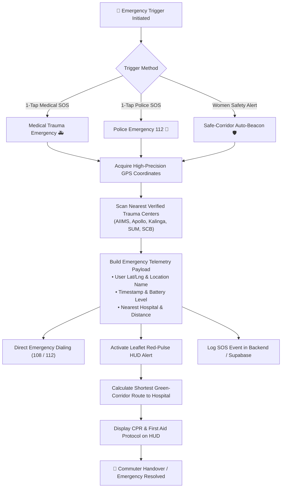
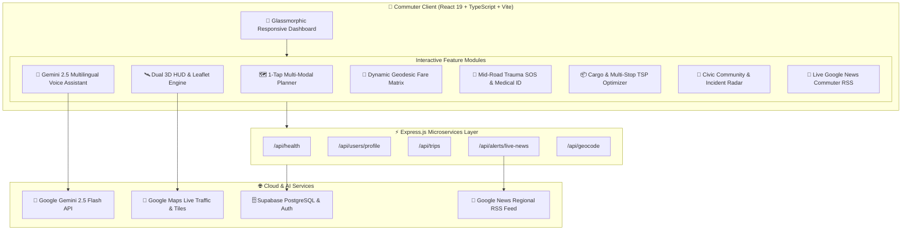

<div align="center">


# 🚌 **MUSAFIR** `(मुसाफ़िर / ମୁସାଫିର)`
### 🌐 **Next-Generation 3D Smart Multi-Modal Urban Mobility & AI Transit Ecosystem**

<p align="center">
  <b>Unifying 82+ CRUT Ama Bus Routes, Ama E-Ride EV Feeders, Dynamic Great-Circle Fare Matrix, Real-Time Emergency Medical SOS, Civic Commuter Community & Multi-Stop Cargo Logistics into One High-Performance Experience.</b>
</p>

[](https://msfr-app-for-hackathon.vercel.app/)
[](./WORKFLOW.md)
[](https://github.com/avijiitt/msfr-app-for-hackathon)
[](https://opensource.org/licenses/MIT)

<br/>

[](https://react.dev/)
[](https://www.typescriptlang.org/)
[](https://vitejs.dev/)
[](https://tailwindcss.com/)
[](https://mapsplatform.google.com/)
[](https://leafletjs.com/)
[](https://deepmind.google/technologies/gemini/)
[](https://supabase.com/)
[](https://expressjs.com/)
[](https://web.dev/progressive-web-apps/)

</div>

---

## 📑 **Table of Contents**
- [🌟 Problem Statement & Solution](#-problem-statement--the-musafir-solution)
- [💎 10 Unique Game-Changing USPs (SIH Winning Highlights)](#-10-unique-game-changing-usps-sih-winning-highlights)
- [🚨 Trauma SOS & 108 Emergency Green Corridor Workflow](#-trauma-sos--108-emergency-green-corridor-workflow)
- [🔄 Full System Architecture & Detailed Workflows (WORKFLOW.md)](./WORKFLOW.md)
- [✨ Key Innovations & Core Features](#-key-innovations--core-features)
  - [1. 3D Floating HUD & Live Fleet Telemetry](#1-3d-floating-hud--live-gps-fleet-simulator)
  - [2. 82+ CRUT Ama Bus Network & Full Route 10](#2-82-crut-ama-bus-network--60-stop-route-10)
  - [3. Multilingual Gemini AI Transit Co-Pilot](#3-multilingual-gemini-ai-assistant-musafir-ai)
  - [4. Multi-Modal Fare & Great-Circle Distance Engine](#4-intelligent-multi-modal-fare--distance-engine)
  - [5. Mid-Road Medical Emergency & Trauma SOS](#5-mid-road-medical-emergency--trauma-dispatch)
  - [6. Women Safety Hub & Night-Safe Corridor Routing](#6-women-safety-hub--night-safe-corridors)
  - [7. Multi-Drop Cargo Logistics & TSP Optimizer](#7-multi-drop-cargo-logistics--tsp-route-optimizer)
  - [8. Smart Camera AI Optical Vision](#8-smart-camera-ai-optical-vision-congestion--dark-spot-lighting-scanner)
  - [9. Multi-Source Civic Intelligence & IoT Fusion](#9-multi-source-civic-intelligence--iot-sensor-fusion)
  - [10. Offline-First Map Engine & Tile Fallback](#10-offline-first-map-engine--tile-caching)
- [🏗️ System Architecture](#-system-architecture)
- [📊 Comparative Advantage Matrix](#-comparative-advantage-matrix)
- [🛠️ Tech Stack & Engineering Highlights](#-tech-stack--engineering-highlights)
- [🔌 Backend REST API Specifications](#-backend-rest-api-specifications)
- [🚀 Getting Started & Local Development](#-getting-started--local-development)
- [🗺️ Verified City Hubs & Corridors](#-verified-city-hubs--transit-corridors)
- [🤝 Contributing & License](#-contributing--license)

---

## 🌟 **Problem Statement & The Musafir Solution**

```
┌──────────────────────────────────────────────────────────────────────────────────┐
│                             THE URBAN COMMUTE PROBLEM                            │
│   ❌ Fragmented Apps: Separate apps for buses, passes, autos & cabs              │
│   ❌ Unpredictable Wait Times: No live feeder EV coordination                    │
│   ❌ Opaque Tariffs: Arbitrary auto/cab surcharges without distance validation   │
│   ❌ Blank Maps Offline: Transit apps fail completely without network connectivity │
│   ❌ Zero Civic Integration: Commuters cannot report road hazards or crowd jams   │
│   ❌ Missing Mid-Trip Medical Safety: No direct 1-tap green-corridor ambulance   │
└──────────────────────────────────────────────────────────────────────────────────┘
                                          │
                                          ▼
┌──────────────────────────────────────────────────────────────────────────────────┐
│                            THE MUSAFIR SOLUTION 🚀                               │
│   ✅ 1-Tap Unified Multi-Modal Trip Planner across all state & local transit      │
│   ✅ Complete 82+ CRUT Ama Bus Routes with accurate intermediate stoppages       │
│   ✅ Great-Circle Geodesic Distance Fare Engine with Stage-by-Stage Tariffs      │
│   ✅ Dual-Engine Offline-Resilient Map: Vector HUD with cached station tiles     │
│   ✅ Real-Time Civic Community Incident Radar with upvoting & map pins           │
│   ✅ Instant Medical Trauma SOS: 1-Tap 108/112 dispatch & Trauma Center Registry │
│   ✅ Voice-Enabled Gemini 2.5 AI Co-Pilot in 8 Indian regional languages        │
│   ✅ Smart Multi-Stop Logistics Optimizer with TSP sequence & fuel calculations  │
└──────────────────────────────────────────────────────────────────────────────────┘
```

**Musafir** solves urban mobility fragmentation by uniting **CRUT Ama Bus (82+ active corridors)**, **Ama E-Ride EV Feeders**, **Shared Mobility**, **Smart Cargo Lockers**, and **Civic Safety** into a single cohesive, lightning-fast web dashboard and mobile application.

---

## 💎 **10 Unique Game-Changing USPs **

> What makes **Musafir** radically superior to existing apps like Google Maps, Chalo, and MoBus?

| # | Feature / USP | Traditional Apps (Chalo / Google Maps) | **Musafir 🚀 (SIH Innovation)** |
| :-: | :--- | :--- | :--- |
| **1** | 🚨 **Mid-Road Trauma Medical SOS** | ❌ None. Users must exit and dial numbers manually. | **1-Tap National Emergency Dispatch (108 / 112 / 1033)** with live telemetry, automated nearest verified Trauma Center registry (AIIMS, Apollo, SUM, KIMS), and CPR guidance. |
| **2** | 🤖 **Multilingual Voice AI Co-Pilot** | ⚠️ Basic English text or rigid search only. | **Google Gemini 2.5 Flash voice & text agent** answering transit, passes, and routes in **8 Indian languages** (Hindi, Odia, Bengali, Telugu, Tamil, Marathi, Gujarati, English). |
| **3** | ⏱️ **Traffic & Dwell-Time Dynamic ETA** | ❌ Fixed distance-over-speed calculation (unrealistic). | **Dynamic Segment ETA Engine** accounting for mode speeds, transit stop dwell buffers (+45s/stop), traffic signals, and IST morning/evening peak traffic multipliers (1.35x–1.45x). |
| **4** | 🚌 **82+ CRUT Bus Corridors + 60-Stop Route 10** | ⚠️ Partial or terminal-to-terminal names only. | **Exhaustive real-world mapping** of all 60 intermediate stops from BBI Airport to CDA Cuttack with instant stop-tap re-planning chips. |
| **5** | 🧮 **Great-Circle Multi-Modal Fare Engine** | ❌ Opaque pricing; no direct mode-by-mode comparisons. | **Side-by-Side Fare Matrix**: CRUT AC Stage Tariffs vs Ordinary Bus vs Ama E-Ride EV Feeders vs Doorstep Autos vs On-demand Cabs with student concession calculator. |
| **6** | 📦 **Hub-Based EV Cargo Logistics & TSP** | ❌ Passenger-only; zero cargo or freight integration. | **Multi-Stop Traveling Salesperson (TSP)** dispatch optimizer with parcel weight/volume inputs, EV fleet telemetry (battery SOC %), and CO₂ carbon offset metrics. |
| **7** | 👥 **Civic Commuter Incident Radar** | ⚠️ Isolated, slow moderation with high spam. | **Decentralized crowd-sourced incident radar** (waterlogging, breakdowns, road hazard) with live confidence upvoting, pulsing HUD markers, and auto-resolution. |
| **8** | 🛰️ **Dual-Engine Vector HUD + Offline Cache** | ❌ Blank, unusable gray screen when internet drops. | **Offline-first architecture** with station-coordinate local caching and dual Leaflet Vector HUD / Google Traffic switching. |
| **9** | 🛡️ **Women Safety Hub & Night-Safe Routing** | ❌ Standard shortest path only (ignores street safety). | **Night-Safe Corridor recommendation** favoring well-lit, high-frequency public corridors + zero-install live family tracking link + emergency panic siren. |
| **10** | 📰 **Live Regional Transit News & Traffic RSS** | ❌ Static notices or zero live event feeds. | **Live municipal traffic alerts and Google News RSS integration** with dynamic relative timestamps ("2m ago", "15m ago"). |

---

## 🚨 **Trauma SOS & 108 Emergency Green Corridor Workflow**

Musafir's **Trauma Emergency Protocol** bridges the critical golden hour for mid-journey road accidents and medical emergencies across urban and state highways.



### 📋 **Trauma SOS Telemetry & Action Specifications:**
1. **Instant Geo-Locking**: Captures high-accuracy device GPS position ($ \pm 5m $) and maps to nearest milestone.
2. **Nearest Hospital Proximity Ranking**: Automatically queries Odisha Trauma Center database (AIIMS Bhubaneswar, Apollo Hospital, SUM Ultimate, KIMS, Capital Hospital) and sorts by real-time distance and transit ETA.
3. **1-Tap Direct Helpline Bridge**: Immediate browser telephony intent dispatch for `tel:108` (Ambulance), `tel:112` (Police Green Corridor), and `tel:1033` (National Highway Helpline).
4. **Digital Medical ID**: Offline-available critical medical tags (Blood Group, Allergies, ICE Family Contact Numbers) shown instantly on the lockscreen/HUD for on-scene first responders.

---

## ✨ **Key Innovations & Core Features**

### 1. 3D Floating HUD & Live GPS Fleet Simulator
- **Dual Vector & Satellite Engine**: Switch between high-contrast Dark Vector HUD, Google Maps Real-Time Traffic, Satellite Hybrid, and Topographical Terrain.
- **Smart GPS Telemetry**: Real-time vehicle marker animations with live-calculated road distances (`km`), estimated transit durations (`mins`), and live fleet coordination.
- **Auto-Lock Viewport Protection**: Commuters can freely pan and zoom without map jitter or forced recentering during background GPS ticks.

### 2. 82+ CRUT Ama Bus Network & 60-Stop Route 10
- **Exhaustive Odisha Transit Coverage**: Complete coverage of Bhubaneswar, Cuttack, Puri, Khordha, Pipili, and Konark.
- **Route 10 Fully Mapped**: 60 exact real-world stoppages from **Biju Patnaik International Airport** to **Biju Patnaik Park, CDA Cuttack** via Jayadev Vihar, Nandankanan, Barang, and Judicial Academy.
- **Corridor Quick-Chips**: Tap intermediate transit stops along any corridor for instant route re-planning.

### 3. Multilingual Gemini AI Assistant (`Musafir AI`)
- **Natural Language Voice & Text**: Powered by Google Gemini 2.5 Flash, understanding voice and text queries in **English, Hindi (हिंदी), Odia (ଓଡ଼ିଆ), Bengali (বাংলা), Telugu (తెలుగు), Tamil (தமிழ்), Gujarati (ગુજરાતી), and Marathi (मराठी)**.
- **Autonomous Intent Execution**: Automatically opens route planners, checks passes, recharges wallets, or triggers SOS without manual menu digging.

### 4. Intelligent Multi-Modal Fare & Distance Engine
- **Precise Geodesic Distance Matrix**: Computes accurate point-to-point road distances using Great-Circle spherical calculations.
- **Side-by-Side Fare Matrix**:
  - **Ama Bus AC Electric**: Official CRUT stage tariff calculation.
  - **Ama Bus Ordinary**: Standard non-AC fares with ₹5 Student Pass discounts.
  - **Ama E-Ride EV Feeder**: Sustainable first/last-mile zero-emission connections.
  - **Auto-Rickshaws & Smart E-Rickshaws**: Regulated doorstep estimations.
  - **Cabs & Bike Taxis**: On-demand market rate benchmarking.

### 5. Mid-Road Medical Emergency & Trauma Dispatch
- **1-Tap Direct National Dispatch**: Direct calling for **Ambulance 108**, **Police 112** (with Green Corridor alerts), and **Highway Helpline 1033**.
- **Live Trauma Center Registry**: AIIMS Bhubaneswar, KIMS, Apollo Hospitals, SUM Ultimate, and Capital Hospital sorted by live distance with 1-tap navigation.
- **Digital Medical ID**: Critical blood group, allergies, and emergency family contact details accessible even in offline mode.

### 6. Women Safety Hub & Night-Safe Corridors
- **Night-Safe Routing**: Prioritizes well-lit, high-frequency public corridors with active CCTV and verified commuter density.
- **Family Share Link**: Generates a zero-install live tracking link displaying real-time GPS coordinates, vehicle details, and battery percentage.
- **Emergency Siren**: High-decibel audible alarm for panic situations.

### 7. Multi-Drop Cargo Logistics & TSP Route Optimizer
- **Traveling Salesperson (TSP) Engine**: Optimizes multi-stop deliveries for couriers and small businesses using simulated annealing heuristics.
- **Individual Parcel Weight Customization**: Select quick weights (`0.5 kg` to `50 kg`) or custom decimal values with instant pricing.
- **Green Metrics**: Tracks estimated fuel savings, route length reduction, and CO2 emissions cut.

### 8. Smart Camera AI Optical Vision (Congestion & Dark Spot Lighting Scanner)
- **Computer Vision Traffic Analysis**: Scans live smart CCTV camera nodes across high-density junctions (Jayadev Vihar, Rasulgarh, KIIT Square, Master Canteen) calculating real-time vehicle density, corridor velocity, and gridlock alerts.
- **Dark Spot Low-Lux Illumination Scanner**: Real-time ambient lux detection (<25 Lux) flags unlit road stretches and non-functional streetlights to the municipal electrical squad (BSCL) while guiding night commuters onto well-lit corridors.
- **AI Anomaly Triggers**: Real-time detection of stalled carriers, curb bottlenecks, and pedestrian surges with 98.4% detection accuracy.

### 9. Multi-Source Civic Intelligence & IoT Sensor Fusion
- **Unified Multi-Source Fusion**: Combines **IoT storm drainage and rainfall depth sensors (BMC)**, **municipal work orders (BSCL)**, **AI-based CCTV hazard detection**, and **environmental air quality nodes (AQI/PM2.5)** into one live civic dashboard.
- **Automated Sump Pump & Flood Radar**: Monitors water accumulation at vulnerable highway underpasses (Iskcon, Vani Vihar, Acharya Vihar) with automated drainage pump triggers.
- **Crowdsourced + Sensor Verified Incident Radar**: Commuters report and verify road hazards backed by real-time sensor confidence scoring.

### 10. Offline-First Map Engine & Tile Caching
- **Never a Blank Map**: Pre-cached station coordinates and intelligent tile fallback ensure the map remains functional during network drops.
- **Offline Mode Indicator**: Visual status badge informing commuters when operating from local storage cache.

---

## 🏗️ **System Architecture**



---

## 📊 **Comparative Advantage Matrix**

| Capability | Standard Transit Apps | Google Maps | **Musafir 🚀** |
| :--- | :---: | :---: | :---: |
| **82+ CRUT Ama Bus Routes** | ⚠️ Partial | ⚠️ Bus only | **✅ Complete with 60-stop Route 10** |
| **Multi-Modal Fare Comparison** | ❌ No | ❌ Fragmented | **✅ Side-by-side AC, Ordinary, EV, Cab** |
| **Offline Map Tile Fallback** | ❌ Blank Screen | ⚠️ Download required | **✅ Built-in Station Cache & Graceful Tile Fallback** |
| **Mid-Road Trauma SOS & 108 Dispatch** | ❌ No | ❌ No | **✅ 1-Tap Green Corridor & Hospital Registry** |
| **Women Safety & Night-Safe Corridors** | ❌ No | ❌ No | **✅ Lit Corridors, Safety Scores & Live Family Share** |
| **Multilingual AI Voice Assistant** | ❌ No | ⚠️ Basic English | **✅ 8 Indian Languages via Gemini 2.5** |
| **Multi-Drop Cargo TSP Optimization** | ❌ No | ❌ No | **✅ Real-time TSP sequence & fuel telemetry** |
| **Civic Incident Reporting & Radar** | ❌ No | ⚠️ Limited | **✅ Crowdsourced upvotes & interactive map** |

---

## 🛠️ **Tech Stack & Engineering Highlights**

```
Frontend:          React 19.x • TypeScript 5.x • Vite 6.x • Tailwind CSS 3.4
Maps & Geospatial: Google Maps Platform (Live Traffic) • Leaflet 1.9 • Turf.js
AI & Intelligence: Google Gemini 2.5 Flash • Web Speech API (Voice Recognition)
Backend:           Node.js • Express.js • RSS/XML Parser • In-Memory Fallback Cache
Database & Auth:   Supabase (PostgreSQL) • LocalStorage Resilient Backup
Icons & Design:    Lucide React • Google Material Symbols • Glassmorphism CSS
```

---

## 🔌 **Backend REST API Specifications**

| Method | Endpoint | Description |
| :--- | :--- | :--- |
| `GET` | `/api/health` | Service health status, database connection, and AI readiness |
| `GET` | `/api/users/profile?email=...` | Retrieve commuter profile, student concession status, and Medical ID |
| `POST` | `/api/users/profile` | Register or update user profile in Supabase PostgreSQL |
| `GET` | `/api/trips?userId=...` | Fetch commuter trip history and carbon savings ledger |
| `POST` | `/api/trips` | Record completed transit trip with mode, fare, and distance |
| `GET` | `/api/alerts/live-news` | Live commuter news feed parsed from regional Google News RSS |
| `GET` | `/api/community/incidents` | Fetch active crowdsourced transit incidents and upvotes |
| `POST` | `/api/community/incidents` | Submit a new commuter incident with category and coordinates |

---

## 🚀 **Getting Started & Local Development**

### 1. Prerequisites
- **Node.js**: `v18.0.0` or higher
- **npm**: `v9.0.0` or higher

### 2. Clone the Repository
```bash
git clone https://github.com/avijiitt/msfr-app-for-hackathon.git
cd msfr-app-for-hackathon
```

### 3. Install Dependencies
```bash
npm install
```

### 4. Configure Environment Variables
Create a `.env` file in the project root:
```env
# Google Maps Platform (Live Traffic & Tiles)
VITE_GOOGLE_MAPS_API_KEY=your_google_maps_api_key_here

# Google Gemini AI (Multilingual Assistant)
VITE_GEMINI_API_KEY=your_gemini_api_key_here

# Supabase PostgreSQL (User profiles & ledger)
VITE_SUPABASE_URL=https://your-project.supabase.co
VITE_SUPABASE_ANON_KEY=your_supabase_anon_key_here

# Optional: Server Port (default 3001)
PORT=3001
```

### 5. Start Development Server
```bash
# Runs frontend on http://localhost:5173
npm run dev
```

### 6. Build for Production
```bash
npm run build
```

---

## 🗺️ **Verified City Hubs & Transit Corridors**

<div align="center">

| Region / City | Hub Stations | Primary Corridors |
| :--- | :--- | :--- |
| **Bhubaneswar Central** | Master Canteen, Jayadev Vihar, Vani Vihar, Patia, Infocity, KIIT | Nandankanan Road, Janpath, Cuttack Road |
| **CDA / Cuttack** | Badambadi, CDA Sector 6, CDA Sector 9, Judicial Academy, Sati Choura | Trisulia Bridge, Ring Road, Biju Patnaik Park |
| **Smart Logistics Hubs** | Mancheswar Industrial Estate, Rasulgarh, Baramunda ISBT | NH-16 Cargo Corridor, Khordha Bypass |
| **Heritage & Tourism** | Puri Sea Beach, Dhauli Shanti Stupa, Pipili Toll, Konark Sun Temple | Puri-Bhubaneswar Highway (NH-316) |

</div>

---

## 🤝 **Contributing & License**

Contributions are welcome! Please feel free to open issues or submit pull requests.

1. Fork the Project
2. Create your Feature Branch (`git checkout -b feature/AmazingFeature`)
3. Commit your Changes (`git commit -m 'Add some AmazingFeature'`)
4. Push to the Branch (`git push origin feature/AmazingFeature`)
5. Open a Pull Request

Distributed under the **MIT License**. See `LICENSE` for more information.

---

<div align="center">

<b>Developed with ❤️ for Indian Multi-Modal Urban Mobility & Hackathon 2026</b>

<br/>

[🚀 Launch Musafir App](https://msfr-app-for-hackathon.vercel.app/) • [🐛 Report Bug](https://github.com/avijiitt/msfr-app-for-hackathon/issues) • [✨ Request Feature](https://github.com/avijiitt/msfr-app-for-hackathon/issues)

</div>
