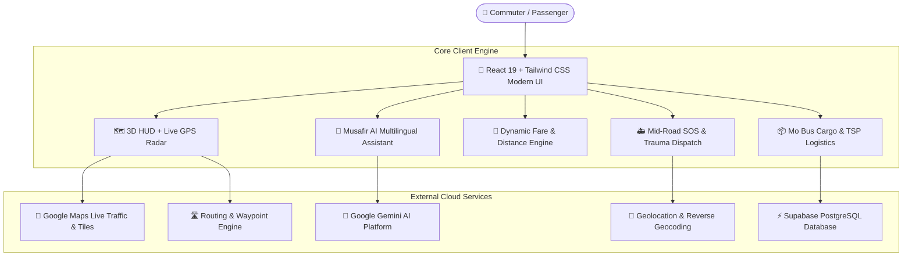

<div align="center">

# 🚌 **MUSAFIR** `(मुसाफ़िर / ମୁସାଫିର)`
### 🌐 **Next-Gen 3D Smart Multi-Modal Urban Mobility & AI Transit Ecosystem**

<p align="center">
  <b>Unifying Mo Bus, Feeder EVs, Regional Metro, Dynamic Fare Engine, Mid-Road Medical SOS & Smart AI Cargo Logistics into One High-Performance Experience.</b>
</p>

[](https://msfr-app-for-hackathon.vercel.app/)
[](https://github.com/avijiitt/msfr-app-for-hackathon)

<br/>

[](https://react.dev/)
[](https://www.typescriptlang.org/)
[](https://vitejs.dev/)
[](https://tailwindcss.com/)
[](https://mapsplatform.google.com/)
[](https://leafletjs.com/)
[](https://supabase.com/)
[](https://deepmind.google/technologies/gemini/)

</div>

---

## ⚡ **Quick Access & Deployment**
- 🚀 **Live Production URL:** [msfr-app-for-hackathon.vercel.app](https://msfr-app-for-hackathon.vercel.app/)
- 📦 **GitHub Repository:** [github.com/avijiitt/msfr-app-for-hackathon](https://github.com/avijiitt/msfr-app-for-hackathon)
- 🏙️ **Primary Smart Transit Network:** Capital Region Urban Transport (CRUT) — Bhubaneswar, Cuttack & Puri Corridors

---

## 🌌 **The Urban Mobility Bottleneck & The Musafir Solution**

```
┌────────────────────────────────────────────────────────────────────────┐
│                        THE URBAN COMMUTE PROBLEM                       │
│   ❌ Fragmented Transit Apps     ❌ Opaque Fares & Overcharging        │
│   ❌ No Real-Time EV Radar       ❌ Zero Hyperlocal Stops Integration │
│   ❌ Unreliable Safety Alerts    ❌ Missing Crowdsourced Cargo         │
└────────────────────────────────────────────────────────────────────────┘
                                    │
                                    ▼
┌────────────────────────────────────────────────────────────────────────┐
│                       THE MUSAFIR SOLUTION 🚀                          │
│   ✅ 1-Tap Multi-Modal Planner   ✅ Dynamic Great-Circle Fare Matrix   │
│   ✅ 3D HUD Live GPS Fleet Radar ✅ 500m Verified Hyperlocal Radar     │
│   ✅ Instant Medical & SOS Siren ✅ AI Multilingual Transit Assistant  │
│   ✅ Mo Bus Individual Cargo     ✅ Smart Route Load Balancing         │
└────────────────────────────────────────────────────────────────────────┘
```

**Musafir** solves the fragmented public transit problem by uniting **Mo Bus (60+ active corridors)**, **Mo E-Ride EVs**, **Local Trains**, **Auto Rickshaws**, and **Shared Cabs** into a single cohesive, high-performance web dashboard & mobile application.

---

## 💎 **Core Features & 3D Interactive Capabilities**

### 🛰️ 1. 3D Floating HUD & Live GPS Fleet Simulator
- **Live Traffic Flow & Tile Switcher:** Real-time Google Traffic layers, roadmaps, satellite hybrid, and terrain modes in a sleek floating glassmorphic dock.
- **Smart GPS Telemetry:** Live-calculated road distances (`km`), trip durations (`mins`), and dynamic vehicle markers.
- **Viewport Auto-Lock:** Preserves manual user zoom & pan states without jitter during real-time GPS telemetry updates.

### 🚑 2. Mid-Road Medical Emergency & Trauma SOS
- **1-Tap Direct National Dispatch:** Free Ambulance 108, Police 112 with Green Corridor signal override, and Highway Helpline 1033.
- **Trauma Center Registry:** AIIMS Bhubaneswar, KIMS, Apollo, SUM Ultimate, and Capital Hospital sorted by live distance with 1-tap calling.
- **Bystander First-Aid Protocols:** On-screen guide for accident trauma, bleeding control, and spinal precautions.

### 🤖 3. Multilingual AI Assistant (`Musafir AI`)
- **Natural Language Transit Voice & Text:** Query routes, calculate fares, book passes, or trigger emergency SOS in **English, Hindi, Odia (ଓଡ଼ିଆ), Bengali, Telugu, Tamil, & Marathi**.
- **Action Execution:** Automatically parses user intent and executes in-app actions without friction.

### 🧮 4. Intelligent Multi-Modal Fare Engine
- **Precise Geodesic Distance Matrix:** Computes exact travel distances between 30+ verified urban hubs & custom pin coordinates.
- **Side-by-Side Fare Comparison:** Compares Mo Bus AC Electric, Ordinary Bus, E-Rickshaws, Cabs, Bike Taxis, and Suburban Rail with student/senior concession rates.

### 📦 5. Mo Bus Cargo & Multi-Drop Logistics Optimization
- **Individual Parcel Weight Selection:** Select quick weights (`0.5 kg` to `50 kg`) or custom decimal kg with live cargo rate cards.
- **Traveling Salesperson (TSP) Optimization:** Real-time multi-stop sequence planning with energy/fuel saving metrics.

---

## 🏗️ **System Architecture & Data Flow**



---

## 🛠️ **Tech Stack & Engineering Highlights**

| Layer | Technology | Purpose |
| :--- | :--- | :--- |
| **Frontend Framework** | `React 19` + `TypeScript 5` | Reactive, ultra-responsive UI |
| **Build & Bundler** | `Vite 6` + `Rolldown` | Sub-second hot reloads & optimized production chunks |
| **Styling & 3D Glass** | `Tailwind CSS 3.4` | Glassmorphism, 3D cards, dark mode |
| **Mapping Engine** | `Google Maps Platform` + `Leaflet 1.9` | Live traffic flow, satellite imagery, O-D polylines |
| **AI Intelligence** | `Google Gemini 2.5 Flash` | Multilingual NLP assistant & transit route reasoning |
| **Backend & Storage** | `Supabase` + `PostgreSQL` | Real-time booking ledger, offline sync |
| **Icons & Visuals** | `Lucide React` + `Google Material Symbols` | Modern UI symbology |

---

## 🚀 **Local Setup & Development**

```bash
# 1. Clone the repository
git clone https://github.com/avijiitt/msfr-app-for-hackathon.git
cd msfr-app-for-hackathon

# 2. Install dependencies
npm install

# 3. Create your environment file
cp .env.example .env
# Add your VITE_GOOGLE_MAPS_API_KEY and VITE_GEMINI_API_KEY

# 4. Start the development server
npm run dev

# 5. Build for production
npm run build
```

---

<div align="center">
  <b>Built with ❤️ for Indian Urban Mobility & Hackathon 2026</b>
</div>
