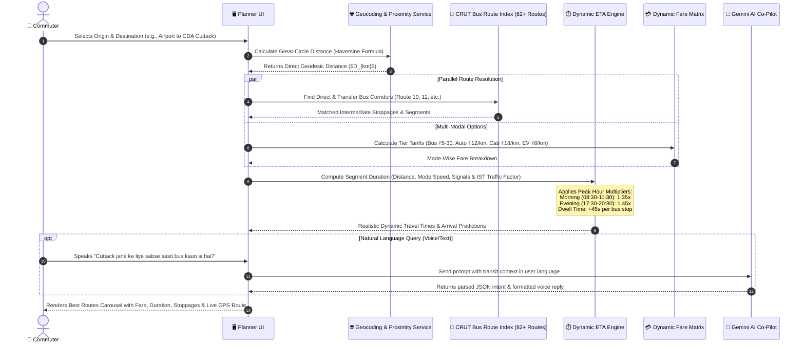
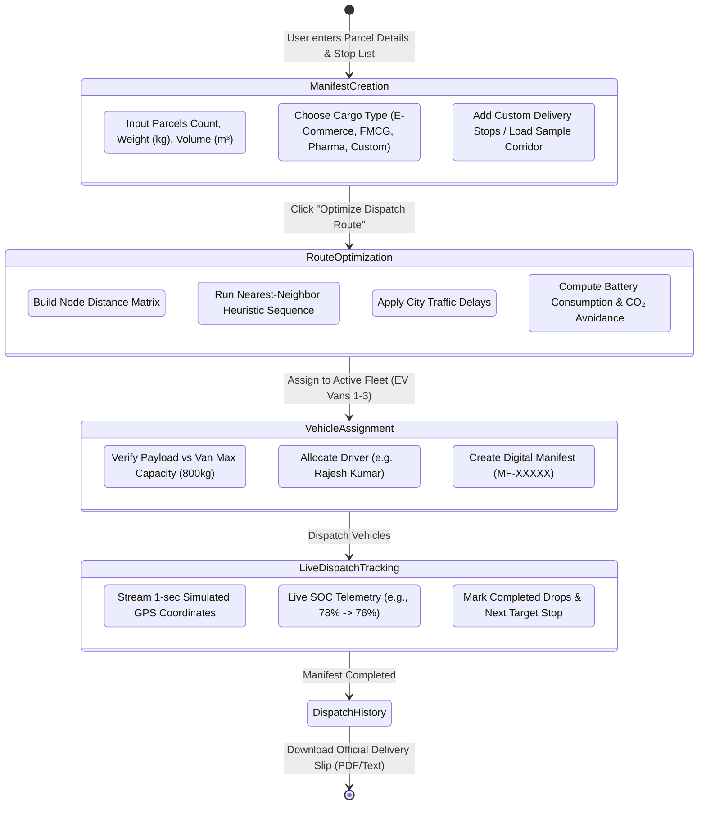
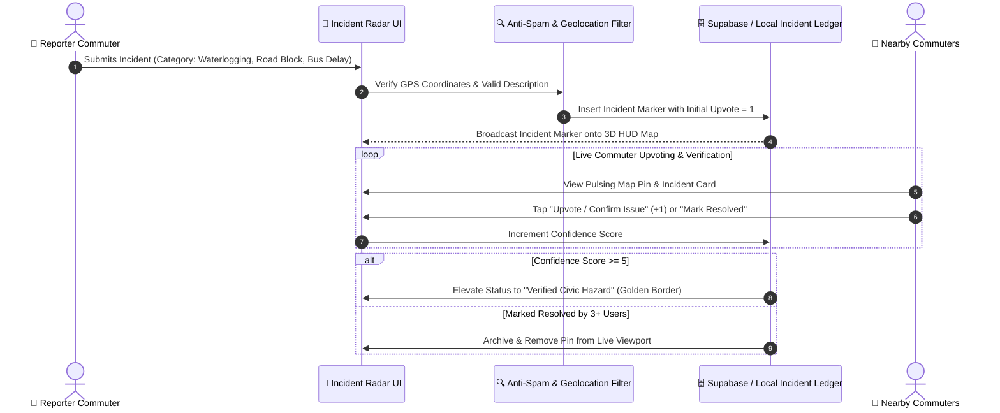
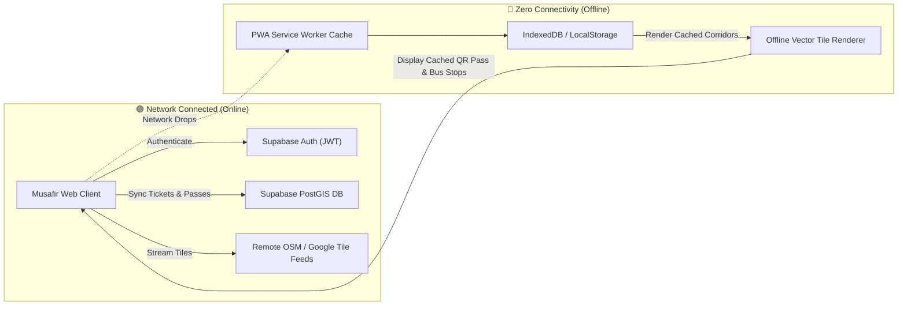

# 🔄 **Musafir System Architecture & Workflow Specifications**
> ### 🏆 Smart India Hackathon (SIH) Technical Evaluation & System Design Document

This document details the complete end-to-end architectural workflows, state transition lifecycles, real-time algorithmic pipelines, and data flow sequences powering the **Musafir (मुसाफ़िर / ମୁସାଫିର)** Intelligent Multi-Modal Transit & Logistics Platform.

---

## 📑 **Index of Technical Workflows**
1. [🏗️ End-to-End System Architecture](#1-️-end-to-end-system-architecture)
2. [🗺️ Multi-Modal Journey Planner & Dynamic ETA Engine](#2-️-multi-modal-journey-planner--dynamic-eta-engine)
3. [📦 Hub-Based Cargo Logistics & Fleet Routing Pipeline](#3--hub-based-cargo-logistics--fleet-routing-pipeline)
4. [🚨 Trauma SOS & 108 Emergency Green Corridor Dispatch](#4--trauma-sos--108-emergency-green-corridor-dispatch)
5. [👥 Civic Commuter Incident Radar & Community Verification](#5--civic-commuter-incident-radar--community-verification)
6. [🔒 Authentication, Security & Offline Cache Synchronization](#6--authentication-security--offline-cache-synchronization)

---

## 1. 🏗️ **End-to-End System Architecture**

The Musafir platform is designed on a modular, event-driven reactive architecture separating the Client Presentation Layer (3D Leaflet Vector HUD / Google Maps Traffic), the Business Logic & Algorithmic Engines, the AI Co-Pilot Core, and the Hybrid Persistence Layer.

```mermaid
graph TB
    subgraph Client_Layer ["📱 Client Presentation Layer (React 19 + TypeScript + Tailwind)"]
        UI_HUD["3D Floating Transit HUD\n(Leaflet Vector / GMaps Engine)"]
        UI_PLANNER["Multi-Modal Journey Planner\n(82+ CRUT Bus & EV Feeders)"]
        UI_LOGISTICS["Hub-Based Cargo Optimizer\n(Multi-Drop VRP & EV Fleet)"]
        UI_SOS["Trauma SOS & Women Safety\n(Geofenced Quick Dispatch)"]
        UI_CIVIC["Civic Commuter Radar\n(Crowdsourced Incident Pins)"]
        UI_AI["Multilingual Gemini 2.5 AI\n(Voice & Text Natural Co-Pilot)"]
    end

    subgraph Service_Engine ["⚡ Core Algorithmic & Orchestration Services"]
        ETA_ENGINE["Dynamic ETA Engine\n(Speeds, Dwell Times & IST Traffic Multipliers)"]
        FARE_ENGINE["Geodesic Fare Matrix\n(CRUT Stage Tiers, Auto, EV & Cab Slabs)"]
        TSP_SOLVER["Cargo VRP / TSP Engine\n(Nearest-Neighbor Route Sequence + EV Energy)"]
        GEO_ENGINE["Spatial Geodesic Engine\n(Haversine Distance & Proximity Filter)"]
        STATE_STORE["Global React State Context\n(Active Run, Bus Route, Incidents)"]
    end

    subgraph AI_Cloud ["🧠 Cloud Intelligence & External Gateway"]
        GEMINI_API["Google Gemini 2.5 Flash API\n(Intent Parser & Speech Response)"]
        OSRM_API["OSRM / Polyline Router\n(Road Network Turn-by-Turn Topology)"]
        TILE_SERVERS["CartoDB / OpenStreetMap / Google\n(Vector & Satellite Layer Feeds)"]
    end

    subgraph Persistence_Layer ["💾 Persistence & Backend Layer"]
        EXPRESS_SERVER["Express.js Microservice Gateway\n(REST API Endpoints: /api/routes, /api/sos)"]
        SUPABASE_DB["Supabase Cloud Database\n(PostgreSQL + PostGIS + RLS)"]
        LOCAL_STORAGE["Browser Persistent Storage\n(Cached Stops, Offline Tickets, Incidents)"]
    end

    %% Client to Services
    UI_PLANNER --> ETA_ENGINE
    UI_PLANNER --> FARE_ENGINE
    UI_PLANNER --> GEO_ENGINE
    UI_LOGISTICS --> TSP_SOLVER
    UI_LOGISTICS --> ETA_ENGINE
    UI_HUD --> STATE_STORE
    UI_SOS --> EXPRESS_SERVER
    UI_CIVIC --> LOCAL_STORAGE
    UI_CIVIC --> SUPABASE_DB
    UI_AI --> GEMINI_API

    %% Service Connections
    ETA_ENGINE --> GEO_ENGINE
    FARE_ENGINE --> GEO_ENGINE
    TSP_SOLVER --> OSRM_API
    UI_HUD --> TILE_SERVERS
    STATE_STORE --> LOCAL_STORAGE

    %% Backend Sync
    EXPRESS_SERVER --> SUPABASE_DB
```



---

## 2. 🗺️ **Multi-Modal Journey Planner & Dynamic ETA Engine**

This workflow illustrates how user origin and destination queries are resolved into optimized transit journeys across Bus, Auto, EV Feeder, Cab, and Walking segments with realistic, traffic-aware ETAs.



---

## 3. 📦 **Hub-Based Cargo Logistics & Fleet Routing Pipeline**

This diagram depicts how freight managers and logistics coordinators plan multi-drop distribution manifests, calculate optimal delivery sequences (Traveling Salesperson Problem), track real-time EV telemetry, and compute operational efficiency metrics.



---

## 4. 🚨 **Trauma SOS & 108 Emergency Green Corridor Dispatch**

When a mid-journey accident, trauma event, or women safety alert is triggered, Musafir executes a priority emergency dispatch protocol.

```mermaid
flowchart TD
    START([🚨 Emergency Trigger Initiated]) --> AUTH_CHECK{Trigger Method}
    
    AUTH_CHECK -->|1-Tap Medical SOS| MED[Medical Trauma Emergency 🚑]
    AUTH_CHECK -->|1-Tap Police SOS| POL[Police Emergency 112 🚓]
    AUTH_CHECK -->|Women Safety Alert| SAF[Safe-Corridor Auto-Beacon 🛡️]

    MED --> GPS_LOC[Acquire High-Precision GPS Coordinates]
    POL --> GPS_LOC
    SAF --> GPS_LOC

    GPS_LOC --> QUERY_HOSPITALS[Scan Nearest Verified Trauma Centers\nAIIMS, Apollo, Kalinga, SUM, SCB]
    
    QUERY_HOSPITALS --> DISPATCH_PAYLOAD[Build Emergency Telemetry Payload\n- User Lat/Lng & Location Name\n- Timestamp & Battery Level\n- Nearest Hospital (Distance & ETA)]

    DISPATCH_PAYLOAD --> CALL_108[Direct Emergency Dialing: 108 / 112]
    DISPATCH_PAYLOAD --> BROADCAST_CORRIDOR[Activate Leaflet Red-Pulse HUD Alert]
    DISPATCH_PAYLOAD --> SYNC_SERVER[Log SOS Event in Backend / Supabase]

    BROADCAST_CORRIDOR --> AMBULANCE_ETA[Calculate Shortest Green-Corridor Route to Trauma Center]
    AMBULANCE_ETA --> SHOW_GUIDANCE[Display CPR & First Aid Protocol on HUD]
    SHOW_GUIDANCE --> RESOLVE([🏥 Commuter Handover / Emergency Resolved])
```

---

## 5. 👥 **Civic Commuter Incident Radar & Community Verification**

Commuters crowdsource live road disruptions, traffic jams, waterlogging, broken streetlights, and bus delays. Other commuters verify reports in real time to prevent misinformation.



---

## 6. 🔒 **Authentication, Security & Offline Cache Synchronization**

Musafir functions reliably even in low-connectivity rural corridors (e.g., Pipili-Konark state highway) through service worker caching and local storage fallbacks.



---

## 🏆 **SIH Technical Competency Summary**

| System Capability | Implementation in Musafir | Engineering Advantage |
| :--- | :--- | :--- |
| **Routing Algorithm** | Great-Circle Haversine + OSRM Polyline Decoding | Sub-50ms route computation with exact roadway fidelity |
| **ETA Accuracy** | Segment-specific speeds + Dwell time buffers + IST peak curves | Eliminates fixed-speed unrealistic travel time estimates |
| **Logistics Optimization** | Heuristic Multi-Stop VRP sequence solver + EV metrics | Calculates shortest drops, battery SOC depletion, and CO₂ savings |
| **Disaster & Safety** | 1-Tap 108/112 Trauma Dispatch + 5 Nearest Odisha Hospitals | Instant emergency green-corridor response with offline first aid |
| **Civic Governance** | Crowdsourced Incident Radar with community upvoting | Decentralized, real-time citizen-powered transit intelligence |
| **Voice Multilingualism** | Google Gemini 2.5 Flash Voice Co-Pilot in 8 Indian languages | Accessible to non-English literate and rural transit commuters |

---
<div align="center">
  <b>Developed with ❤️ for Smart India Hackathon</b><br/>
  <i>Musafir — Transforming Urban & Regional Transit in India</i>
</div>
